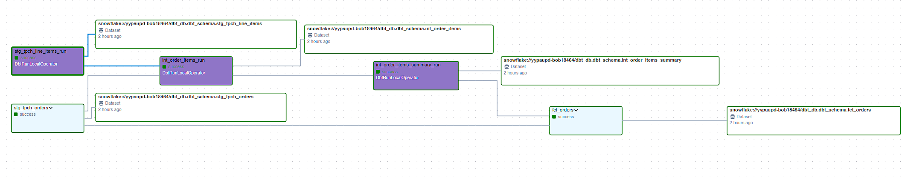

# Data Pipeline Orchestration using DBT, Snowflake, Airflow


## Project Oragnization

This repo is organized into the following directories

```
.
└── dbt-dag          # contains all orchestration executables
    ├── dags         # DAGs for managing dbt pipelines
    │   └── dbt
    │       └── data_pipeline     # dbt-snowflake project directory
    │           ├── analyses      # dbt analysis SQL files
    │           ├── dbt_packages  # contains dbt-utils and other packages
    │           ├── logs          # dbt log files
    │           ├── macros        # custom dbt macros
    │           ├── models        # dbt models for transformations
    │           ├── seeds         # seed data files for dbt
    │           ├── snapshots     # snapshot configurations for dbt
    │           ├── target        # compiled outputs and results
    │           └── tests         # tests for validating dbt models
    ├── include      # additional modules or includes for orchestration
    ├── plugins      # custom plugins for orchestration
    └── tests        # test cases for orchestration
        └── dags     # test DAGs for validation

```

**Airflow DAG**


## Dataset

The dataset used was the `TPCH_SF1` located in snowflake's `SNOWFLAKE_SAMPLE_DATA` database.

### Resource

[Astronomer-Cosmos](https://github.com/astronomer/astronomer-cosmos) was used to easily run/orchestrate the dbt-snowflake data pipeline


